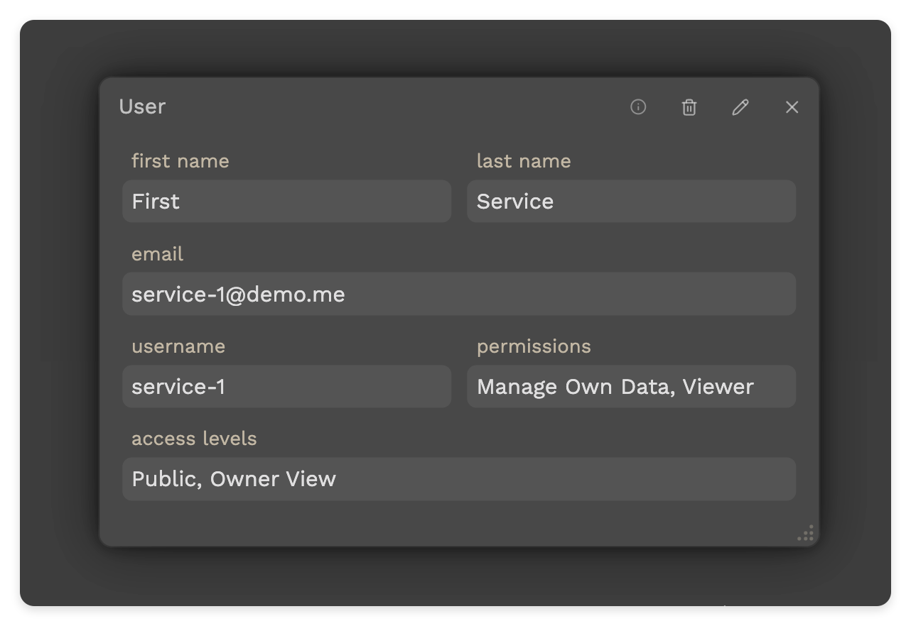
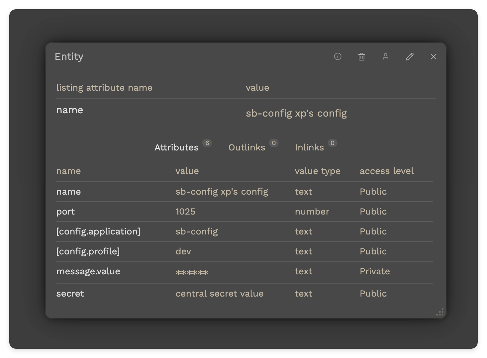

# Features

This page presents the features of this application.

<br/>

## Ontology related features

The main purpose of this application is to provide a simplified knowledge system based on an ontology inspired model.
The knowledge (or information) is managed through entities, entity templates, and attribute templates.
Furthermore, entities can be linked to other entities through entity links.

<br/>

## Spring Boot Config - Expose the configuration

A Spring Boot based service can use Spring Cloud Config client to fetch its configuration.

Let's take a concrete example of a Spring Boot service that uses Spring Cloud Config client to fetch its configuration.
Considering it has this configuration options defined in its application.properties file:

```properties
spring.application.name=sb-config

##
## -------------------------------------
## Load the config from a central point.
## -------------------------------------
##
spring.config.import=configserver:http://localhost:9908/config
spring.cloud.config.username=service-1
spring.cloud.config.password=svc12345
```

When the service starts with the `dev` profile, such as using `SPRING_PROFILES_ACTIVE=dev mvn spring-boot:run`, it will do two calls to load its configuration:

1. First, it fetches the configuration for the default profile, that is a `GET /config/sb-config/default`.
2. Second, it fetches the configuration for the `dev` profile, that is a `GET /config/sb-config/dev`.

To support the exposure of a configuration for such service, in this application there must be:

1. A user (containing username & password) that will be used by the service to fetch the configuration.
    - Such user should have at minimum:
        - `Viewer` permission - so that it can access any public entity attributes.
        - `Owner View` access level - so that it can access all the attributes of the entities it owns (aka it's the owner).
        - See an example:<br>
          
2. An entity representing the configuration. - Besides the attributes representing the configuration settings for that service,
   there are two metadata attributes that must be set: - `[config.application]` - that specifies the name of the application (or service). - `[config.profile]` - that specifies the name of the configuration profile, used at the startup of the application (or service). - See an example:<br/>
   
